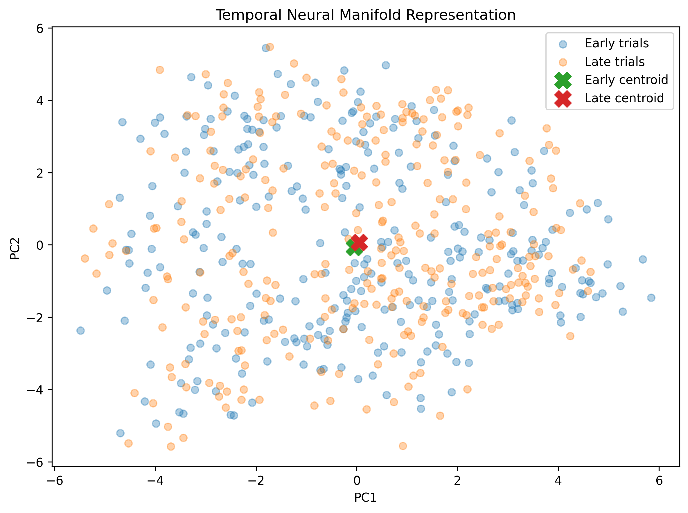

# Robust Neural Decoding via Manifold Geometry under Circuit Drift

**Author:** Sugasini Balakrishnan  
**Date:** August 2026  
**Field:** Computational Neuroscience · Brain-Computer Interfaces · Neural Data Analysis

## Overview

This project investigates how population-level neural activity changes over time and develops a computational framework for studying neural representational stability using population firing dynamics, dimensionality reduction, and neural manifold geometry.

The analysis focuses on movement-aligned neural activity and asks whether population representations remain stable across different temporal segments of a recording.

## Dataset

- **574 trials**
- **137 neural units**
- Trial duration: **0.7 s**
- Movement onset: **0.25 s**
- Alignment window: **−0.20 to +0.45 s**
- Bin size: **10 ms**
- Neural activity matrix: **574 × 137 × 65**

## Analysis Pipeline

1. NWB data structure inspection
2. Trial timing inspection
3. Neural unit metadata analysis
4. Movement-aligned spike binning
5. Population firing dynamics
6. Neuron-level movement responses
7. Statistical significance testing with FDR correction
8. Trial-level neural manifold construction
9. PCA dimensionality reduction
10. Early-versus-late representational analysis
11. Population stability analysis

## Key Results

| Metric | Result |
|---|---:|
| Mean pre-movement firing | 4.601 Hz |
| Mean post-movement firing | 4.097 Hz |
| FDR-significant neurons | 104 / 137 |
| Significant increases | 44 |
| Significant decreases | 60 |
| PC1–3 variance | 12.47% |
| PC1–10 variance | 25.94% |
| Early → late centroid distance | 0.5168 |
| Early/late population correlation | 0.9963 |
| RSA correlation | −0.0257 |
| Relative population change | 6.89% |

### Neuron-level responses

The strongest observed increase was:

**Neuron 53: +6.79 Hz**

The strongest observed decrease was:

**Neuron 89: −9.17 Hz**

Overall, **104 of 137 neurons** showed statistically significant movement-related changes after FDR correction.

## Neural Manifold Analysis

A trial × neuron representation was constructed from movement-aligned population activity and reduced using PCA.

The first three principal components explained **12.47%** of the variance, while the first ten dimensions captured **25.94%**.

Early and late trial populations were then compared using centroid displacement, population correlation, and representational similarity analysis.

## Interpretation

The results demonstrate that movement-related neural activity can be characterized using population geometry and temporal representational stability.

The high early-to-late population correlation (**r = 0.9963**) suggests substantial preservation of population-level firing structure, while the measured centroid displacement and RSA provide complementary measures of representational change.

These findings establish a computational baseline for studying **neural representation under temporal drift**.

## Important Limitation

This dataset does not contain explicit movement-direction or target labels in the inspected trial metadata. Therefore, supervised movement decoding accuracy was **not fabricated or reported**.

The early-versus-late comparison should also not be interpreted as proof of neurodegeneration or pathological neural drift. It is a computational analysis of temporal representational stability within the available recording.

## Future Work

Future experiments will extend this framework toward:

- Cross-session neural manifold alignment
- Procrustes and CCA-based alignment
- Decoder transfer across sessions
- Drift-robust neural decoding
- Evaluation on datasets containing explicit behavioral labels
- Longitudinal recordings for studying physiological and pathological neural drift

## Research Direction

This project forms the computational foundation for investigating whether neural manifold geometry can be used to maintain robust decoding despite changes in neural population dynamics.

**Keywords:** Neural Manifolds · Neural Decoding · Brain-Computer Interfaces · Computational Neuroscience · Neural Drift · Population Coding · PCA · Representational Similarity
### Temporal Neural Manifold

